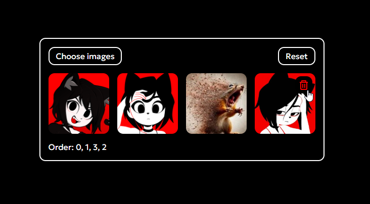
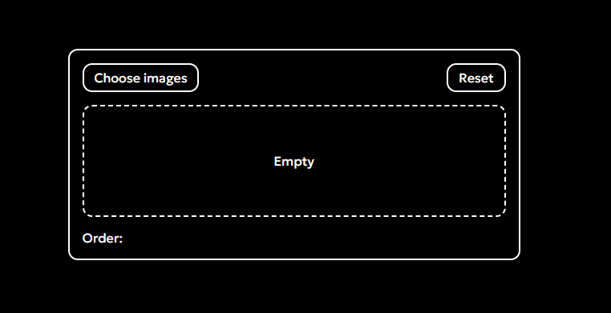

# gallery.mjs
Module for creating galleries with re-ordering

## Example
```html
<section id="wrap">
  <label for="images" class="unselectable">
    Choose images
    <input id="images" type="file" name="images" accept="image/png, image/jpeg, image/webp" multiple="true" onchange="document.getElementById('wrap')?.gallery.import(this.files)" />
  </label>
  <button id="reset" onclick="document.getElementById('wrap')?.gallery.ascending()">Reset</button>

  <label id="loader" for="images" class="unselectable">Empty</label>
  <div id="gallery"></div>

  <span id="order" class="unselectable">Order:</div>
</section>
```
```js
import("/js/modules/gallery.mjs").then((module) => {
  // Initializing the instance
  const instance = new module.gallery(
    document.getElementById("wrap"),
    document.getElementById("images"),
    document.getElementById("gallery"),
    true
  );
});
```
CSS in the `/index.css` file

## Demonstration
### [CodePen](https://codepen.io/mirzaev-sexy/pen/RNPdYvv)

<br>
<br>
<br>


