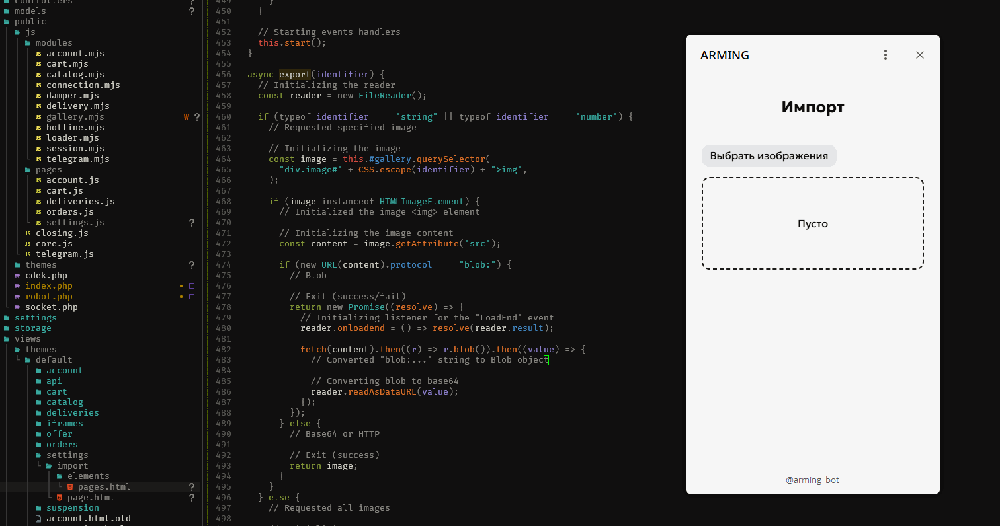

# gallery.mjs
Module for creating galleries with re-ordering

## Example
```html
<section id="wrap">
  <label for="images" class="unselectable">
    Choose images
    <input id="images" type="file" name="images" accept="image/png, image/jpeg, image/webp" multiple="true" onchange="document.getElementById('wrap')?.gallery.import(this.files)" />
  </label>
  <button id="reset" onclick="document.getElementById('wrap')?.gallery.ascending()">Reset</button>

  <label id="loader" for="images" class="unselectable">Empty</label>
  <div id="gallery"></div>

  <span id="order" class="unselectable">Order:</div>
</section>
```
```js
import("/js/modules/gallery.mjs").then((module) => {
  // Initializing the instance
  new module.gallery(
    document.getElementById("wrap"),
    document.getElementById("images"),
    document.getElementById("gallery"),
    true
  );
});
```
CSS in the `/index.css` file

## Example with initial images
```html
<section id="wrap">
  <label for="images" class="unselectable">
    Choose images
    <input id="images" type="file" name="images" accept="image/png, image/jpeg, image/webp" multiple="true" onchange="document.getElementById('wrap')?.gallery.import(this.files)" />
  </label>
  <button id="reset" onclick="document.getElementById('wrap')?.gallery.ascending()">Reset</button>

  <label id="loader" for="images" class="unselectable">Empty</label>
  <div id="gallery" data-initial-images="/images/0.jpg;/images/1.jpg;/images/2.jpg"></div>

  <span id="order" class="unselectable">Order:</div>
</section>
```
```js
import("/js/modules/gallery.mjs").then((module) => {
  // Initializing the instance
  const instance = new module.gallery(
    document.getElementById("wrap"),
    document.getElementById("images"),
    document.getElementById("gallery"),
    true,
  );

  // Initializing saved images
  const images = instance.gallery.getAttribute("data-initial-images")?.split(";");

  // Importing saved images
  instance.import(images?.entries() ?? []);
});
```
CSS in the `/index.css` file

## Example with handling movemens and deletings
```html
<section id="wrap">
  <label for="images" class="unselectable">
    Choose images
    <input id="images" type="file" name="images" accept="image/png, image/jpeg, image/webp" multiple="true" onchange="document.getElementById('wrap')?.gallery.import(this.files)" />
  </label>
  <button id="reset" onclick="document.getElementById('wrap')?.gallery.ascending()">Reset</button>

  <label id="loader" for="images" class="unselectable">Empty</label>
  <div id="gallery" data-initial-images="/images/0.jpg;/images/1.jpg;/images/2.jpg"></div>

  <span id="order" class="unselectable">Order:</div>
</section>
```
```js
import("/js/modules/gallery.mjs").then((module) => {
  // Initializing the instance
  const instance = new module.gallery(
    document.getElementById("product_images_wrap"),
    document.getElementById("product_images_input"),
    document.getElementById("product_images_gallery"),
    true,
  );

  // Initializing the delete button event
  instance.events.get("wrap").set("delete", (event) => {
    // Searching for the closest parent wrap
    const wrap = event.target.closest("div.image")?.getAttribute("id");

    // Deleting the image from the account buffer
    core.account.buffer.delete("import_create_images_" + wrap);
  });

  // Reinitializing the drop event
  instance.events.get("moving").set("drop", (event) => {
    // Searching for the closest parent wrap identifier
    const wrap = event.target.closest("div.image")?.getAttribute("id");

    // Writing into the account buffer (swapping images)
    instance.export(wrap).then((src) => 
      core.account.buffer.write("import_create_images_" + instance.dragged,src.replace("/storage", ""), true));
    instance.export(instance.dragged).then((src) => 
      core.account.buffer.write("import_create_images_" + wrap, src.replace("/storage", ""), true));
  });

  // Initializing saved images
  const images = instance.gallery.getAttribute("data-initial-images")?.split(";");

  // Importing saved images
  instance.import(images?.entries() ?? []);
});
```
CSS in the `/index.css` file


## Demonstration
### [CodePen](https://codepen.io/mirzaev-sexy/pen/RNPdYvv)
<br>


